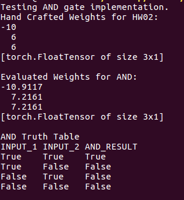
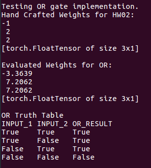
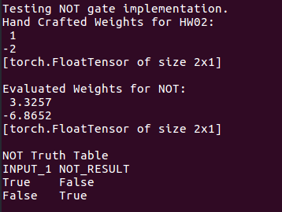
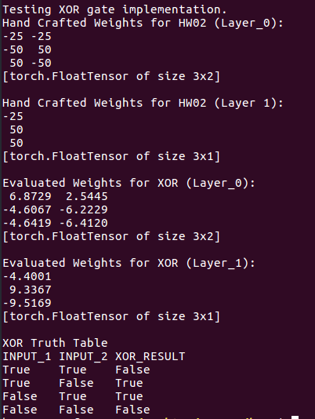

## Implementing Neural Network Backpropagation and Stochastic Gradient Descent
#### Aakash Pydi
---

The neural network with forward propagation and back-propagation pass is implemented in neural_network.py. The functionality of the classes defined in logic_gates.py relies on this neural network. The class representations of the AND, OR, NOT, and XOR gates is given in logic_gates.py. These calsses were modified to derive the weight (theta) values of their corresponding neural network through the use of backword propagation. The training data set was generated in the train() method associated with each class.

The implemented classes were tested in test.py. The output of executing test.py is given below. Note that, the output of test.py is also attached at the end of this file. 

## Comparison of Theta I handcrafted for HW02 vs the one's learnt from back-propagation

### AND Gate
| Handcrafted Weight Layer_0| Derived Backpropagation Weight Layer_0|
|---------------------------:|---------------------------------------:|
|  -10 | -10.9117  |
|   6  |   7.2167 |
|   6  |   7.2167|

---

### OR Gate
| Handcrafted Weight Layer_0| Derived Backpropagation Weight Layer_0|
|---------------------------:|---------------------------------------:|
|  -1 | -3.3639  |
|   2  |   7.2062 |
|   2  |   7.2062|

---

### NOT Gate
| Handcrafted Weight Layer_0| Derived Backpropagation Weight Layer_0|
|---------------------------:|---------------------------------------:|
|  1 | 3.3257 |
|  -2  |   -6.8652 |

---

### XOR Gate
| Handcrafted Weight Layer_0| Derived Backpropagation Weight Layer_0|
|---------------------------:|---------------------------------------:|
|  -25, -25 |  6.8729, 2.5445 |
|   -50, 50  |   -4.6067, -6.2229 |
|    50, -50 |   -4.6419, -6.4120|

| handcrafted Weight Layer_1| Derived Backpropagation Weight Layer_1|
|---------------------------|---------------------------------------|
|  -25 | -4.4001  |
|   50  |   9.3367 |
|   50  |   -9.5169|

---
---
## Corresponding Output of the Test Script

### AND Gate Output

---

### OR Gate Output

---

### NOT Gate Output

---

### XOR Gate Output

---
